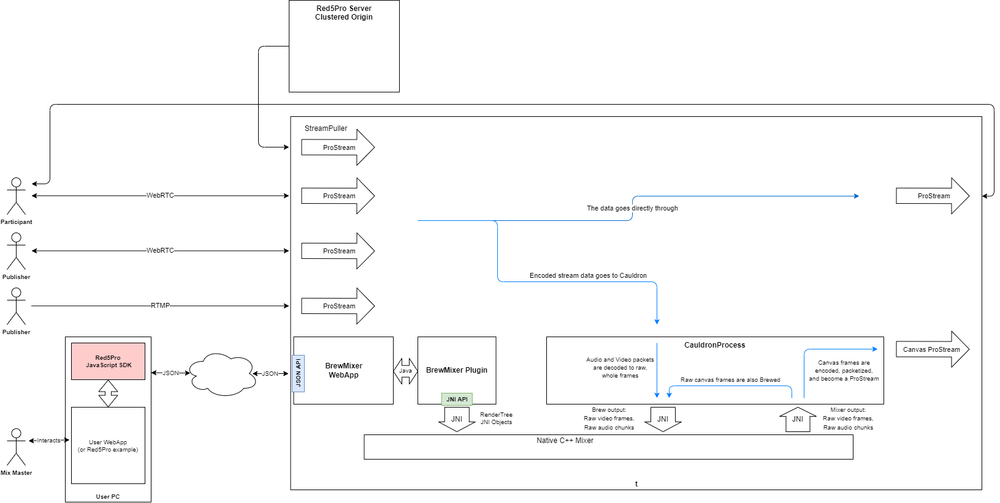
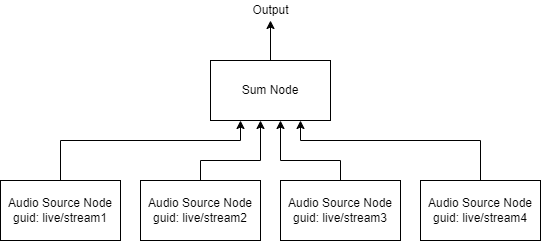
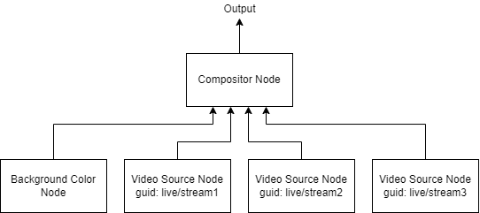

# BrewMixer REST API


*BrewMixer Overview*

Create New Mixer
-----------------------------
Create a new mixer event.

Note that here, the word "event" is used in the sense of a music concert or sporting event, rather than the EventListener sense.

### Create New Mixer Request
POST `${scheme}://${mixerHost}/brewmixer/1.0/${eventName}`

Body:

```json
{
  "event": "event1",
  "path": "live",
  "streamName": "mix1",
  "doForward": true,
  "originIp": "192.168.1.222",
  "width": 1920,
  "height": 1080,
  "frameRate": 30,
  "bitRate": 4000000,
  "maxBitRate": 7000000,
  "qpMin": 28,
  "qpMax": 48,
  "audioSampleRate": 48000,
  "audioChannels": 2,
  "subMixes": 2,
  "action": "create",
  "digest": "03CA2E9BC968DA07BBF16FDC51D5051BFC50DC0CCFA111EBE023981F4453B050",
  "timestamp": 1690333081423
}
```

`event`: String, alphanumeric, up to 256 characters. Name of this mixer or set of mixers. 
`path`: String, up to 1024 characters total for `path` + `/` + `streamName`.
`streamName`: String, up to 1024 characters total for `path` + `/` + `streamName`.
`doForward`: Boolean. True if forwarding stream to another instance (`originIp`).
`originIp`: (Optional if not `doForward`) String, up to 45 characters. Origin node to forward to. Must be a routable address. Usually an Origin node within a cluster.
`width`: Integer, between 2 and 7680. Video frame width in pixels.
`height`: Integer, between 2 and 4320. Video frame height in pixels.
`bitRate`: Integer, between 100 and 1048576. Video data rate in bits per second.
`maxBitRate`: Integer, between 100 and 1048576. Maximum video data rate in bits per second.
`qpMin`: Integer, between 0 and 63. Must be less than or equal to `qpMax`. Minimum h264 quantizer.
`qpMax`: Integer, between 0 and 63. Must be greater than or equal to `qpMin`. Maximum h264 quantizer.
`audioSampleRate`: Integer, between 8000 and 96000. Audio data rate in samples per second.
`audioChannels`: Integer, either 1 and 2 (mono or stereo).
`subMixes`: (Optional) Integer, between 1 and 10. The number of simultaneous mixers to create for this event. Default is 1.

**Authentication params (required for clustered mixers)**
`action`: Always `create`.
`digest`: String, up to 2048 characters.
`timestamp`: Integer (64-bit). Milliseconds since epoch.

**NOTE** that the above validation rules represent the extremes that the REST API will allow. This does not guarantee that the video or audio encoder will truly be able to accomodate the request, or that enough CPU or memory are available. 

**NOTE** For Openh264:
* 12 bits per pixel per frame is lossless.
* Encoder errors when resolution exceeds 3840x2160
* Encoder errors when compressed frame size exceeds half uncompressed size
* Decoder errors when compressed frame size exceeds 1MB

### Create New Mixer Response

**On success:**
HTTP 201: Created.

No body.

**On error:**  
HTTP 400: Bad Request | Validation failure (see `error` response).

HTTP 401: Unauthorized | Missing or invalid `username` or `password`.

Body:

```json
{
  "error" : "<error description>"
}
```


Read All Mixers
-----------------------------
Read the list of active events.

## Read All Mixers Request
GET `${scheme}://${mixerHost}/brewmixer/1.0/`

No body.

## Read Mixers Response

**On success:**

The response is an array of Strings, one for each current event.

```json
[
    "live/mix1"
]
```

**On error:**  
While an empty list may be returned, there are no expected error conditions.


Read Mixer RenderTrees
-----------------------------
Read the list of RenderTrees for the given event.

## Read Mixer RenderTrees Request
GET `${scheme}://${mixerHost}/brewmixer/1.0/${eventName}`

No body.

## Read Mixer RenderTrees Response

**On success:**
HTTP 200: OK

The response is an array of the current RenderTrees for the given event, one for each submix.

```json
[
  {
    "rootVideoNode": {
      "nodes": [
        {
          "streamGuid": "live/stream1",
          "sourceX": 0,
          "sourceY": 0,
          "sourceWidth": 1920,
          "sourceHeight": 1080,
          "destX": 0,
          "destY": 0,
          "destWidth": 1920,
          "destHeight": 1080,
          "node": "VideoSourceNode"
        }
      ],
      "node": "CompositorNode"
    },
    "rootAudioNode": {
      "nodes": [
        {
          "streamGuid": "live/stream1",
          "pan": 0.0,
          "gain": 0.0,
          "node": "AudioSourceNode"
        }
      ],
      "node": "SumNode"
    }
  }
]
```

**On error:**
HTTP 404: Not found | The event `eventName` is not found.


Update Mixer RenderTrees
-----------------------------
Update the RenderTree(s) for a given event. 


## Update Mixer RenderTrees Request
PUT `${scheme}://${mixerHost}/brewmixer/1.0/${eventName}`

```json
[
    {
        "rootVideoNode": {
            "red": 0,
            "green": 0,
            "blue": 1,
            "alpha": 1,
            "node": "SolidColorNode"
        },
        "rootAudioNode": {
            "nodes": [
                {
                    "streamGuid": "live/stream1",
                    "pan": 0,
                    "gain": 0,
                    "node": "AudioSourceNode"
                }
            ],
            "node": "SumNode"
        }
    }
]
```


## Update Mixer RenderTrees Response

**On error:**
HTTP 400: Bad Request | Validation failure (see `error` response).

HTTP 404: Not found | The event `eventName` is not found.


Delete Mixers
-----------------------------
Stop all sub-mixers for a given event.

## Delete Mixers Request
DELETE `${scheme}://${mixerHost}/brewmixer/1.0/${eventName}`

No body.

## Delete Mixers Response

**On success:**
HTTP 200: OK

**On error:**
HTTP 404: Not found | The event `eventName` is not found.

# RenderTree
A RenderTree is a node graph that describes how the audio and video sources are combined within the mixer. The RenderTree describes the output of one mixer video stream -- one sub-mix. A given event may consist of multiple simultaneous sub-mixes and thus uses mutliple RenderTrees.

A RenderTree has two branches: there is an audio sub-tree and a video sub-tree.


*Audio RenderTree*


*Video RenderTree*

Audio Nodes
-----------------------------

## Audio Source Node
An `AudioSourceNode` takes no input, and produces audio chunks from a given video stream. The node can also adjust the gain and panning of the source.

```json
{
    "streamGuid": "live/stream1",
    "pan": 0,
    "gain": -6,
    "node": "AudioSourceNode"
}
```

`streamGuid`: String, up to 1024 characters. The full path and name of the source stream.
`pan`: Float, from -100 to 100 inclusive. -100 is fully left, 0 is centered, and 100 is fully right.
`gain`: Float, from -100 to 0. Gain in decibels.
`node`: String, always `AudioSourceNode`.

## Sum Node
A `SumNode` takes a list of one or more input Audio Nodes and outputs the sum. Note that the sum node simply sums, and if the resulting total gain is excessive, clipping will occur. Make sure that the gain of the input signals is sufficiently low to prevent clipping.

Because addition is commutative, the order of the addend nodes is unimportant.

```json
      "nodes": [
        {
          "streamGuid": "live/stream1",
          "pan": 0,
          "gain": -6,
          "node": "AudioSourceNode"
        },
        ...
      ],
      "node": "SumNode"
```

`nodes`: Array/list of audio nodes.
`node`: String, always `SumNode`.

Video Nodes
-----------------------------
## Solid Color Node
The `SolidColorNode` takes no input and produces a field of solid color filling the entire frame. This is useful when source videos may not be present, or when they may not fill the entire frame. With a `SolidColorNode` drawn first, the "empty spaces" will have a determinate color. (Otherwise, indeterminate results may occur, such as junk data left over from the previous frame.)

```json
{
    "red": 0,
    "green": 0,
    "blue": 0,
    "alpha": 1,
    "node": "SolidColorNode"
}
```

`red`: Float, between 0.0 and 1.0.
`green`: Float, between 0.0 and 1.0.
`blue`: Float, between 0.0 and 1.0.
`alpha`: Float, between 0.0 and 1.0.
`node`: String, always `SolidColorNode`.

## Video Source Node
A `VideoSourceNode` provides pixel data from a given live stream. You supply both the source rectangle (what part of the incoming pixel data will we copy) and the destination rectangle (where in the mixer video frame will the source be drawn), allowing you to crop, stretch, and mirror source videos.

```json
{
    "streamGuid": "live/stream1",
    "sourceX": 0,
    "sourceY": 0,
    "sourceWidth": 1920,
    "sourceHeight": 1080,
    "destX": 0,
    "destY": 0,
    "destWidth": 960,
    "destHeight": 540,
    "node": "VideoSourceNode"
}
```

`streamGuid`: String, up to 1024 characters. The full path and name of the source stream.
`sourceX`: Integer, between 0 and 7680 inclusive. 
`sourceY`: Integer, between 0 and 4320 inclusive.
`sourceWidth`: Integer, from 0 and 7680 inclusive. 
`sourceHeight`: Integer, from 0 to 4320 inclusive.
`destX`: Integer, between 0 and 7680 inclusive.
`destY`: Integer, between 0 and 4320 inclusive.
`destWidth`: Integer, from -7680 and 7680 inclusive. Negative values imply mirroring.
`destHeight`: Integer, from -4320 to 4320 inclusive. Negative values imply mirroring.
`node`: Always `VideoSourceNode`.

## Compositor Node
The `CompositorNode` draws a list of source nodes in order from first to last into the mixer frame. Therefore, the last node is drawn "on top". You can manipulate the order of the list to control the order of drawing.

```json
{
  "nodes": [
    {
      "red": 0,
      "green": 0,
      "blue": 0,
      "alpha": 1,
      "node": "SolidColorNode"
    },
    {
      "streamGuid": "live/stream1",
      "sourceX": 0,
      "sourceY": 0,
      "sourceWidth": 1920,
      "sourceHeight": 1080,
      "destX": 0,
      "destY": 0,
      "destWidth": 960,
      "destHeight": 540,
      "node": "VideoSourceNode"
    },
    ...
  ],
  "node": "CompositorNode"
}
```

`nodes`: Array/list of video nodes.
`node`: String, always `CompositorNode`.


Complete Example RenderTree
-----------------------------
This example render tree takes four input streams and renders them in a 2x2 grid. The audio is a mix of all four streams, each at -6dB (anticipating the sum will be 0dB).

```json
[
  {
    "rootVideoNode": {
      "nodes": [
        {
          "red": 0,
          "green": 0,
          "blue": 0,
          "alpha": 1,
          "node": "SolidColorNode"
        },
        {
          "streamGuid": "live/stream1",
          "sourceX": 0,
          "sourceY": 0,
          "sourceWidth": 1920,
          "sourceHeight": 1080,
          "destX": 0,
          "destY": 0,
          "destWidth": 960,
          "destHeight": 540,
          "node": "VideoSourceNode"
        },
        {
          "streamGuid": "live/stream2",
          "sourceX": 0,
          "sourceY": 0,
          "sourceWidth": 1920,
          "sourceHeight": 1080,
          "destX": 960,
          "destY": 0,
          "destWidth": 960,
          "destHeight": 540,
          "node": "VideoSourceNode"
        },
        {
          "streamGuid": "live/stream3",
          "sourceX": 0,
          "sourceY": 0,
          "sourceWidth": 1920,
          "sourceHeight": 1080,
          "destX": 0,
          "destY": 540,
          "destWidth": 960,
          "destHeight": 540,
          "node": "VideoSourceNode"
        },
        {
          "streamGuid": "live/stream4",
          "sourceX": 0,
          "sourceY": 0,
          "sourceWidth": 1920,
          "sourceHeight": 1080,
          "destX": 960,
          "destY": 540,
          "destWidth": 960,
          "destHeight": 540,
          "node": "VideoSourceNode"
        }
      ],
      "node": "CompositorNode"
    },
    "rootAudioNode": {
      "nodes": [
        {
          "streamGuid": "live/stream1",
          "pan": 0,
          "gain": -6,
          "node": "AudioSourceNode"
        },
        {
          "streamGuid": "live/stream2",
          "pan": 0,
          "gain": -6,
          "node": "AudioSourceNode"
        },
        {
          "streamGuid": "live/stream3",
          "pan": 0,
          "gain": -6,
          "node": "AudioSourceNode"
        },
        {
          "streamGuid": "live/stream4",
          "pan": 0,
          "gain": -6,
          "node": "AudioSourceNode"
        }
      ],
      "node": "SumNode"
    }
  }
]
```
